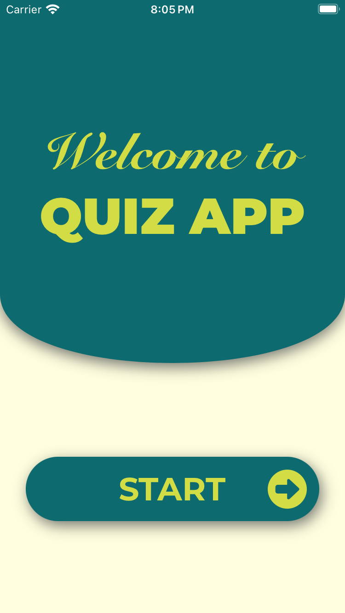
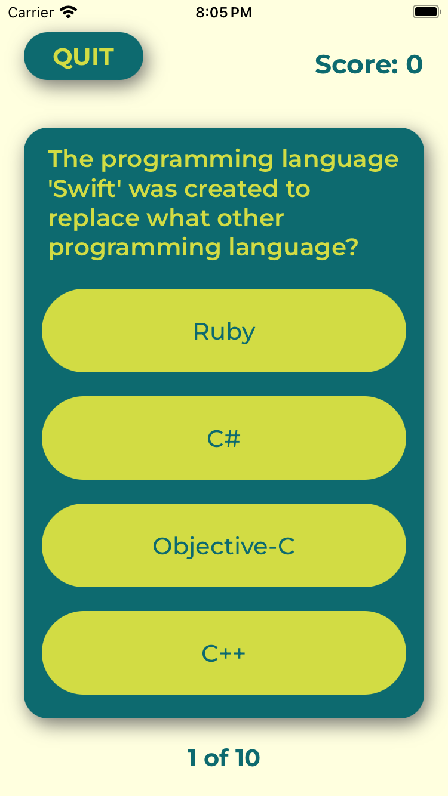
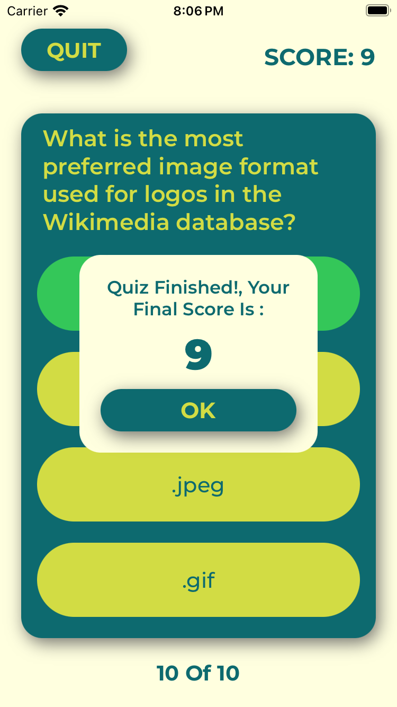

# Quiz-App
A Quiz app made using Open Trivia DB and optimised for Voice Over support. The framework used is UIKit and architecture followed is MVVM with use of latest swift structured concurrency(async await).

